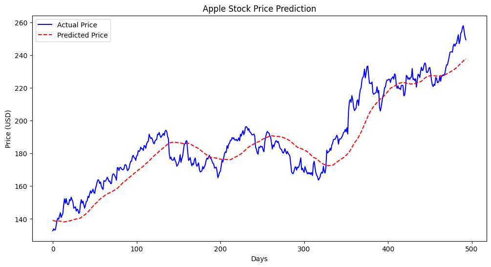

# Stock Price Predictor 📈

## Overview
This project applies Machine Learning techniques to financial data. Using historical stock data from Apple (AAPL), I built a Linear Regression model to predict future closing prices based on moving averages.

## Technologies Used
* **Python:** Core programming language.
* **Pandas:** Data manipulation and cleaning.
* **Matplotlib:** Visualizing price trends and prediction accuracy.
* **Scikit-Learn:** Building and training the Linear Regression model.
* **yfinance API:** Fetching real-time stock market data.

## Key Results
* The model successfully identified the long-term trend of the stock.
* Achieved a model confidence score of **[Insert Score]**.

## How to Run
1.  Install dependencies: `pip install -r requirements.txt`
2.  Run the notebook: `jupyter notebook stock_prediction.ipynb`

